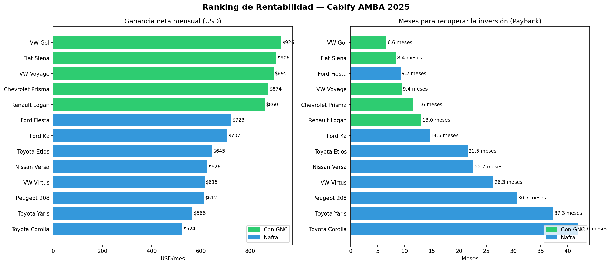
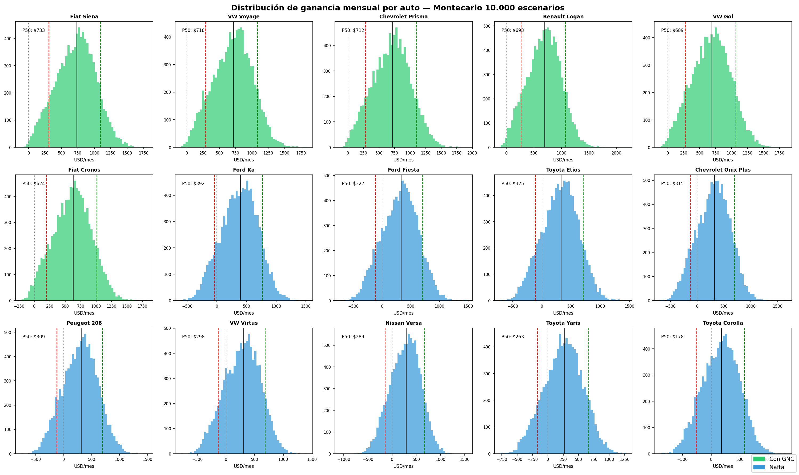
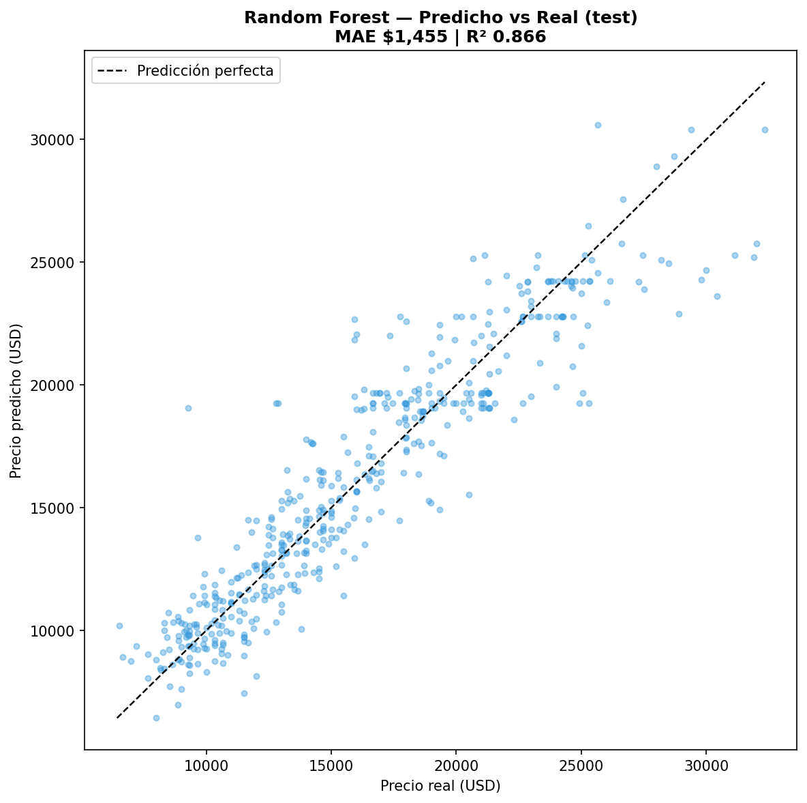

# 🚗 Análisis de Rentabilidad de Vehículos para Cabify en Argentina ( EN DESARROLLO )


## 🚀 Dashboard interactivo
**[→ Ver dashboard en vivo](https://cabify-rentabilidad-argentina.streamlit.app)**

Configurá tu escenario (km diarios, precio de nafta, GNC, seguro) y obtené un ranking de rentabilidad personalizado en tiempo real.

---

## 🏆 Hallazgos principales

- **El Fiat Siena con GNC es el auto más rentable** para trabajar en Cabify en AMBA, con una ganancia neta de ~$626 USD/mes y un payback de ~14 meses. Combina el precio de entrada más bajo del análisis (~$8.650 USD), GNC y el mantenimiento más barato (80 ARS/km).
- **El filtro regulatorio cambió el ranking:** Cabify/GCBA exigen antigüedad máxima de 10 años (año ≥ 2016). El ranking anterior estaba dominado por autos que **no podían trabajar en la plataforma** — el VW Gol, líder pre-filtro, quedó con solo 12 publicaciones elegibles y cayó al 4° puesto.
- **El GNC pasó de ventaja a condición de viabilidad:** los autos a GNC gastan ~$195.000 ARS/mes en combustible contra $595.000-714.000 de los de nafta. Los 6 primeros puestos son todos GNC; en la simulación de Montecarlo, varios autos a nafta (Versa, 208, Yaris, Corolla) tienen ganancia mediana **negativa** — pierden plata en el escenario típico.
- **El mantenimiento es el costo silencioso:** prorratear cubiertas, frenos y service cuesta $312.000-468.000 ARS/mes según el modelo. Incorporarlo (modelo económico v2, junto con valor residual y seguro/patente proporcionales al valor del auto) bajó la ganancia promedio del análisis ~48%.
- **El ingreso bruto mensual sigue siendo la variable de mayor impacto** en la sensibilidad (±$246 USD ante ±20%), por encima del tipo de cambio (-$146/+$199) y los km diarios (±$86): el conductor controla su rentabilidad más con sus horas de trabajo que con los costos del auto.
- **Modelo ML de precios (Random Forest):** predice el precio de mercado con R² 0,87 y MAE ~$1.455 USD, superando a la regresión lineal baseline (R² 0,84, MAE $1.682). Año y km explican >75% de la importancia. La proyección de depreciación a 3 años/+100.000 km muestra que los autos ya depreciados (Voyage, Prisma, Siena: 13-17%) retienen mejor su valor que los de gama media (Versa: 32%) — el Fiat Siena gana por ambas puntas: máxima ganancia operativa y depreciación baja.
- **El Toyota Corolla es el peor negocio del análisis:** su precio de entrada (~$22.600 USD) genera amortización, seguro y patente imposibles de cubrir — opera a pérdida (-$151 USD/mes) y además se deprecia ~$5.000 USD en 3 años.

---

## 📸 Vista del análisis

**Ranking de rentabilidad (modelo v2)** — ganancia neta mensual y payback por modelo; los autos con GNC dominan y dos quedan a pérdida:



**Simulación de Montecarlo** — distribución de ganancia mensual en 10.000 escenarios por modelo, con percentiles P10/P50/P90:



**Modelo ML de predicción de precios** — precio predicho vs real en el test set (Random Forest, R² 0,87):



---

## 📌 Descripción
Proyecto de Data Science que analiza qué vehículo es más rentable para trabajar
en plataformas de ride-hailing (Cabify) en Argentina, considerando costos de
adquisición, combustible, mantenimiento, depreciación con valor residual,
seguro/patente proporcionales al valor del auto y simulación de escenarios
macroeconómicos. Incluye una capa de Machine Learning que predice precios de
mercado, detecta oportunidades de compra y proyecta depreciación.

El análisis cubre **15 modelos de autos** elegibles para Cabify (año ≥ 2016),
**2.440 publicaciones reales de MercadoLibre** post-limpieza y **10.000
escenarios simulados** por modelo mediante Montecarlo.

---

## 🔍 Metodología

| Fase | Descripción | Herramientas |
|---|---|---|
| 1. Scraping | Recolección de precios de MercadoLibre (3.780 registros) | Playwright, BeautifulSoup |
| 2. Limpieza | Normalización de monedas, outliers con IQR, tipo de cambio en tiempo real | pandas, dolarhoy.com |
| 3. Filtro regulatorio | Solo autos elegibles para Cabify: año ≥ 2016 (antigüedad máx. 10 años GCBA) | pandas |
| 4. EDA | Análisis exploratorio de precios y km por modelo, validación del supuesto GNC | matplotlib, seaborn |
| 5. Modelo de costos v2 | TCO mensual: combustible, amortización con valor residual, mantenimiento por km, seguro y patente proporcionales al valor | Python |
| 6. Montecarlo | 10.000 escenarios por modelo con variables inciertas | NumPy |
| 7. Sensibilidad | Tornado chart de impacto de cada variable | matplotlib |
| 8. Scoring | Ranking multicriterio por perfil de conductor | pandas |
| 9. ML de precios | Random Forest: predicción de precio, detección de oportunidades, depreciación proyectada | scikit-learn |
| 10. Dashboard | App interactiva con parámetros configurables | Streamlit |

---

## 📊 Datos

- **Fuente:** MercadoLibre Argentina — sección autos usados
- **Período de scraping:** 1er mitad de 2026 (última actualización: julio 2026)
- **Registros:** 3.780 publicaciones scrapeadas → **2.440 elegibles** tras filtro regulatorio (año ≥ 2016) y limpieza de outliers
- **Modelos analizados:** 15 (se excluyó solo el VW Polo por quedar con pocas publicaciones elegibles post-filtro)
- **Tipo de cambio:** dólar blue scrapeado en tiempo real desde dolarhoy.com

---

## 📁 Estructura del proyecto

    cabify-rentabilidad-argentina/
    ├── data/
    │   ├── raw/                          # Datos crudos scrapeados
    │   ├── processed/                    # Dataset canónico limpio
    │   └── external/                     # Datos de fuentes externas
    ├── notebooks/
    │   ├── 01_scraping.ipynb             # Scraping de MercadoLibre
    │   ├── 02_limpieza_EDA.ipynb         # Limpieza, filtro regulatorio y EDA
    │   ├── 03_modelo_costos.ipynb        # Modelo de rentabilidad v2
    │   ├── 04_montecarlo.ipynb           # Simulación de Montecarlo
    │   ├── 05_scoring.ipynb              # Scoring multicriterio
    │   └── 06_prediccion_precios.ipynb   # ML: predicción de precios y depreciación
    ├── src/
    │   ├── scraper.py                    # Spider de MercadoLibre
    │   ├── modelo.py                     # Modelo económico v2 (costos y rentabilidad)
    │   └── precios_combustible.py        # Scraper de precios de nafta/GNC
    ├── models/                           # Modelos ML entrenados (no versionados)
    ├── reports/figures/                  # Gráficos generados
    ├── dashboard/
    │   └── app.py                        # App Streamlit
    └── requirements.txt

---

## 🛠️ Stack tecnológico

- **Lenguaje:** Python 3.11
- **Datos:** pandas · numpy · scipy
- **Scraping:** Playwright · BeautifulSoup · requests
- **Visualización:** matplotlib · seaborn · plotly
- **Modelado:** scikit-learn (Random Forest) · NumPy (Montecarlo)
- **Dashboard:** Streamlit
- **Deploy:** Streamlit Cloud

---

## 🚀 Cómo ejecutar el proyecto localmente

```bash
# 1. Clonar el repo
git clone https://github.com/francataldi/cabify-rentabilidad-argentina.git

# 2. Crear y activar el entorno
conda create -n cabify-ds python=3.11.8
conda activate cabify-ds
pip install -r requirements.txt

# 3. Correr el scraper (opcional — el dataset ya está incluido)
python src/scraper.py

# 4. Abrir los notebooks
jupyter lab

# 5. Correr el dashboard
streamlit run dashboard/app.py
```

---

## 👤 Autor

**Franco Cataldi Gagliardi**

Estudiante de Ciencia de Datos — Universidad de Buenos Aires (UBA)

[](https://www.linkedin.com/in/franco-cataldi-gagliardi-2347a9268/)
[](https://github.com/francataldi)
